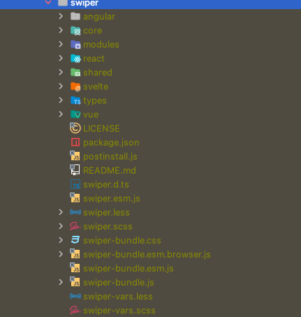

## swiper

                 
## 파일 구성
1. esm.js (ECMAScript Module)

## 모듈 분석
 - Virtual: 필요한 양만큼의 슬라이드를 유지한다. 메모리 릭에 좋다고 되어있음. 단 loop mode 에서는 작동을 안한다고함
 - Keyboard: 특정 키보드 키로 슬라이드를 움직일수 있게 한다.
 - Mousewheel: 마우스휠로 특정 축을 움직일수 있음
 - Navigation: 좌우의 슬라이드로 바꿀수 있는 기능, 해당하는 element 를 생성하고, 클래스이름을 넣어줘야한다.
 - Pagination: 슬라이드 숫자만큼의 페이징을 표시해서 누를시 해당 슬라이드로 이동 기능
 - Scrollbar:  페이지네이션 대신 스크롤로 슬라이드를 조정할수 있음.(같이 안될꺼같음)
 - Parallax: 시차 전환 애니메이션인데 정확히 감이 안옴
 - Zoom: 확대 기능
 - Lazy: 늦게 나타내는것
 - Controller: 슬라이드, 혹은 컨테이너에 의해 컨트롤 한다. 기본은 슬라이드, 역 방향으로 기능
 - A11y: 웹 접근성!
 - History: 브라우저에 히스토리를 남길 수 있다
 - HashNavigation: 브라우저 해쉬를 남겨서 특정 url 해쉬값으로 링크를 걸고 첫번째 슬라이드로 유도할수 있어보임
 - Autoplay
 - Thumbs
 - FreeMode: 자유로운 이펙트 같음
 - Grid: 그리드 레이아웃을 이용해서, 열 조작, 방향을 조작 할 수 있어 보임
 - Manipulation:  조작을 할수 있다. 돔은 임의 적으로 넣을수있음(리액트,뷰,앵귤러는 지원하지 않음)
 - EffectFade
 - EffectCube
 - EffectFlip
 - EffectCoverflow
 - EffectCreative
 - EffectCards